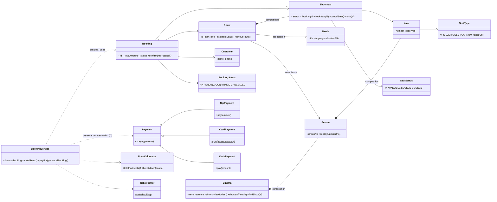
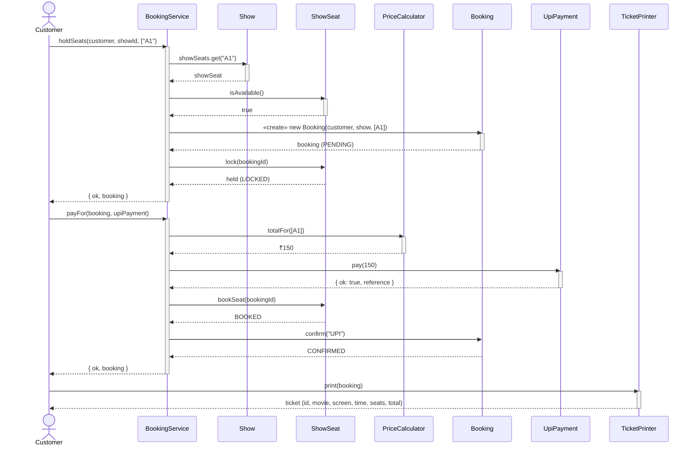

# 🎬 CineServe — Movie Ticket Booking System

**TCS-504 System Design · Assignment 1** — a single-cinema booking system built with strict LLD
discipline, shipped **both** as a bookable website and as a fully tested domain core.

▶ **Website:** open `index.html` in any browser (or the single-file build `dist/standalone.html`).
🧪 **Tests:** `node test/booking.test.js` — **19 passing**, zero dependencies.

---

## What it does (F1–F8)

| # | Feature | Where |
|---|---------|-------|
| F1 | List all movies currently playing | `Cinema.listMovies()` |
| F2 | For a chosen movie, list its shows (screen + start time) | `Cinema.showsOf()` |
| F3 | For a chosen show, display the seat layout with AVAILABLE / BOOKED status | `BookingService.seatLayout()` |
| F4 | Book one or more seats (reject an already-booked seat) | `BookingService.holdSeats()` |
| F5 | Price the booking by seat type: SILVER 150, GOLD 250, PLATINUM 450 | `PriceCalculator` |
| F6 | Pay by UPI, Card or Cash — a failed payment must NOT confirm | `Payment` hierarchy + `BookingService.payFor()` |
| F7 | Print a ticket: booking id, movie, screen, time, seats, total | `TicketPrinter` |
| F8 | Cancel a booking — the seats become AVAILABLE again | `BookingService.cancelBooking()` |

---

## Step A — Requirement analysis

### Functional requirements (testable)

- **FR1** — The system SHALL list every movie that has at least one scheduled show, showing title, language and duration.
- **FR2** — For a chosen movie, the system SHALL list every show as *screen number + start time*.
- **FR3** — For a chosen show, the system SHALL render the full seat map where each seat is visibly AVAILABLE or BOOKED (or LOCKED while a payment is in flight).
- **FR4** — The system SHALL accept a set of seat ids for a show and create a booking, **rejecting** the request if any seat is already BOOKED or does not exist, leaving all state unchanged on rejection.
- **FR5** — The system SHALL compute the payable amount as SILVER × ₹150 + GOLD × ₹250 + PLATINUM × ₹450, itemised per seat type. *(The PDF's PLATINUM price was cut off; ₹450 is defined once in `SeatType`.)*
- **FR6** — The system SHALL accept payment via UPI, Card or Cash; a payment failure SHALL leave the booking unconfirmed and release every held seat.
- **FR7** — After a confirmed payment the system SHALL produce a ticket containing booking id, movie, screen, start time, seat numbers and total amount.
- **FR8** — The system SHALL cancel a CONFIRMED booking; its seats SHALL return to AVAILABLE. Cancelling a non-CONFIRMED booking SHALL be rejected.

### Non-functional requirements

1. **Modularity** — one class per file; each class has exactly one reason to change.
2. **Extensibility** — adding `NetBankingPayment` is one new file + one line in the UI's method list; no existing class changes.
3. **Input validation** — invalid seat numbers, empty selections, bad UPI/card formats and unknown booking ids produce clear messages; the program never crashes on bad input.
4. **Testability** — the domain has zero DOM/network coupling; 19 assertions cover every feature and edge case.

---

## Step B — Noun–verb analysis

| Noun found | Keep as a class? | Reason |
|---|---|---|
| Movie | **yes** | has its own data and identity |
| Seat | **yes** | has number, type, price |
| "seat layout" | no | it is a *view* of a Show's seats, not a thing — a render method |
| Screen | **yes** | an auditorium owns its physical seats |
| Cinema | **yes** | the theatre; owns screens, is the F1 entry point |
| Show | **yes** | a screening = movie + screen + time; owns availability |
| ShowSeat | **yes** | status of ONE seat FOR ONE show (the availability lives here) |
| Customer | **yes** | name + phone identify the booker |
| Booking | **yes** | id, show, seats, amount, status |
| Payment | **yes** | the pay(amount) contract (abstract) |
| UPI / Card / Cash | **yes** (3 subclasses) | how each method actually pays |
| PriceCalculator | **yes** | turns seats into a total (verb "price" became a class) |
| TicketPrinter | **yes** | verb "print" became a class — printing only |
| BookingService | **yes** | verb "book" became an orchestrator |
| "ticket", "money", "menu" | no | ticket is Booking's *output*; money is a number; menu is UI, not domain |

---

## Step C — The classes

### Core entities

| Class | Its ONE responsibility | Knows | Must NOT do |
|---|---|---|---|
| `Movie` | hold catalog data | title, language, duration | know about shows/screens |
| `Seat` | one physical seat | number, SeatType | track availability |
| `Screen` | one auditorium | screenNo, its seats | know about bookings |
| `Cinema` | the theatre | name, screens, shows | book seats or take payment |
| `Show` | one screening | movie, screen, time, ShowSeats | orchestrate bookings |
| `ShowSeat` | status of one seat for one show | seat, status, bookingId | price anything, touch UI |
| `Customer` | identify the booker | name, phone | create bookings |
| `Booking` | record one booking | id, show, seats, total, status | print tickets, charge anyone |

### Behaviour / service classes

| Class | Its ONE responsibility | Must NOT do |
|---|---|---|
| `Payment` (abstract) | the payment contract `pay(amount)` | know bookings or seats |
| `UpiPayment` / `CardPayment` / `CashPayment` | how each method pays | know Booking/BookingService |
| `PriceCalculator` | seats → total | anything else |
| `TicketPrinter` | format & print a ticket | confirm bookings or move seats |
| `BookingService` | orchestrate the booking flow end-to-end | create a concrete Payment (it receives one — D) |

---

## Step D — Relationships (with lifetime-test justifications)

| Pair | Choice | Justification (lifetime test: *if the whole dies, does the part die?*) |
|---|---|---|
| Cinema → Screen | **Composition** | Screens exist only inside their cinema — demolish it, the screens go too. |
| Screen → Seat | **Composition** | Seats are manufactured as part of the auditorium; no screen, no seats. |
| Show → Movie | **Association** | A movie exists before/after any show; shows merely reference it. |
| Show → Screen | **Association** | A screening uses an existing screen; both outlive the scheduling. |
| Show → ShowSeat | **Composition** | A ShowSeat is "seat *for this* show" — cancel the show, that status record dies. |
| Booking → Customer | **Association** | The customer outlives any one booking. |
| Booking → ShowSeat | **Association** | Seats are referenced by the booking; the seat statuses outlive it (they go back to AVAILABLE). |
| Booking → Payment | **Association** | A payment records a transaction; it doesn't die when a booking is later cancelled. |
| Payment → UpiPayment | **Inheritance** | UpiPayment IS-A Payment; same contract, specialised behaviour. |
| BookingService → Booking | **Association (uses)** | The service creates/references bookings but their lifecycle is the store's, not its own. |

---

## Step E — Class diagram



*(If your submission needs a drawn diagram, paste this into any Mermaid renderer — mermaid.live —
and export as PNG. Notation: filled diamond = composition, open arrow = association, hollow triangle = inheritance.)*

---

## Step F — Sequence diagram: "book 1 seat and pay by UPI"



---

## Step G — Code map (one class per file)

```
src/
├── SeatType.js          SeatStatus.js        BookingStatus.js
├── Movie.js   Seat.js   Screen.js   Cinema.js   Show.js   ShowSeat.js
├── Customer.js          Booking.js
├── Payment.js           UpiPayment.js   CardPayment.js   CashPayment.js
├── PriceCalculator.js   TicketPrinter.js
├── BookingService.js    demo-data.js
index.html               ← the website (loads the same classes)
test/booking.test.js     ← 19 assertions, zero dependencies
scripts/build-standalone.mjs
dist/standalone.html     ← single-file build of the site
```

## OOP concepts — where to point at them

| Concept | Where |
|---|---|
| **Encapsulation** | `ShowSeat._status` is private with a read-only getter; changes only via `bookSeat()/lock()/cancelSeat()`. `Booking._totalAmount/_status` likewise. |
| **Abstraction** | `Payment` cannot be instantiated (`new.target` guard); `pay()` is an abstract contract. |
| **Inheritance** | `UpiPayment`, `CardPayment`, `CashPayment` extend `Payment`. |
| **Runtime polymorphism** | `service.payFor(b, payment)` calls `payment.pay(total)` — the concrete method dispatches at runtime. Swap UPI→Card→Cash with zero service changes. |
| **Compile-time polymorphism** | `CardPayment.luhn()` static + instance validation; `UpiPayment.pay(amount)` handles the with-args/validate vs. parameterless demo paths. |
| **Static members** | `Booking._nextId` — unique `BKG-0001…` ids across all bookings. |
| **`this` keyword** | Used across constructors/methods (e.g. `SeatType.ALL` referencing `this`-constructed instances; `Booking` setters binding `this.showSeats`). |
| **Composition** | `Cinema→Screens`, `Screen→Seats`, `Show→ShowSeats` — parts are created in the owner's constructor. |
| **Aggregation** | `Show→Movie/Screen` — references to objects created elsewhere (they outlive the show). |
| **Association** | `Booking→Customer`, `BookingService→Booking`. |

---

## SOLID mapping

| Principle | Where in this code |
|---|---|
| **S** — Single responsibility | `Booking` never prints (that's `TicketPrinter`); pricing lives only in `PriceCalculator`; who asks for a price change edits one file. |
| **O** — Open/closed | Add `NetBankingPayment extends Payment` as a new file — `BookingService`, tests and every existing class stay untouched. |
| **L** — Liskov substitution | Every `Payment` child honours the same `pay(amount) → {ok, reason?, reference?}` contract with no extra setup calls. |
| **I** — Interface segregation | `Payment` does NOT force `refund()` on all children; refunds are probed only when supported (cash has no refund trail). |
| **D** — Dependency inversion | `BookingService.payFor(booking, payment)` receives a `Payment` — it never constructs a `CardPayment` itself; high-level policy depends on the abstraction. |

## What we deliberately did NOT do (and why)

- **No database / persistence** — scope is a single cinema demo; in-memory store keeps the LLD the star.
- **No concurrent-booking server / locks across processes** — the LOCKED state demonstrates the *pattern* (hold → pay → confirm) but a real deployment needs a transactional backend.
- **No seat-hold expiry timer** — same reason; it's a scheduling concern, not a booking-domain one.
- **No login/auth** — "Customer" is captured per booking; identity management is out of the 8-feature scope.

## Edge cases (§10) — all demonstrated

1. **Booking an already-BOOKED seat** → rejected, nothing changes (`holdSeats` returns `{ok:false}` before any mutation).
2. **Failed payment** → booking stays PENDING (never CONFIRMED), all held seats released to AVAILABLE.
3. **Cancelling a booking** → seats show AVAILABLE again; refund noted for digital methods.
4. **Invalid seat number / menu choice** → clear message ("Seat P1 does not exist"), no crash.

## Clean-code checklist

- [x] Intention-revealing names — `bookedSeatCount`, `isAvailable`, `holdSeats`
- [x] No number-series names — no `list1`, `temp1`
- [x] Every function does ONE thing — `renderSeatmap` never books
- [x] No function longer than ~20 lines (UI render helpers are split per concern)
- [x] Max 2 levels of indentation; named conditions (`isAvailable`, `isConfirmed`)
- [x] ≤2 parameters preferred; 4+ became objects (`holdSeats(customer, showId, seatNumbers)` uses a result object)
- [x] No side effects in getters — `seatLayout()` is a pure view
- [x] Constants instead of magic numbers — `SeatType.SILVER = 150`, no bare `150` in logic
- [x] DRY — pricing computed in exactly one place, reused by Booking, PriceCalculator and the UI

---

*Built for TCS-504 System Design, Assignment 1 · Aniket Negi · [github.com/aniketnegi12](https://github.com/aniketnegi12)*
